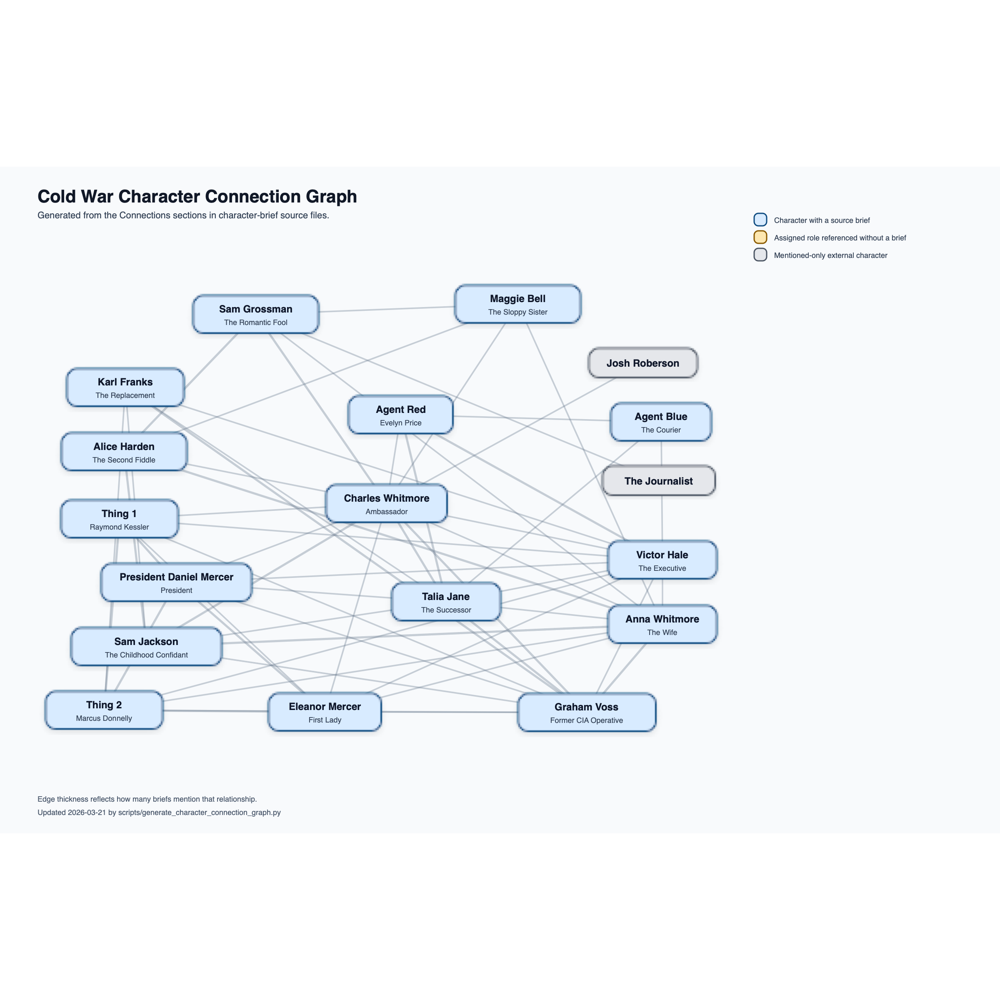

# Character Connection Graph

Auto-generated from the `Connections` sections in `character-briefs/source/*.txt`.

## Legend

- Blue nodes are characters with a source brief.
- Gold nodes are assigned roles referenced in other briefs but not yet written.
- Gray nodes are mentioned-only external characters.
- Thicker lines mean the relationship is mentioned in more briefs.

## Connected Characters

- **Charles Whitmore (Ambassador)**: Agent Red, Alice Harden, Anna Whitmore, Eleanor Mercer, Graham Voss, Josh Roberson, Maggie Bell, President Daniel Mercer, Sam Grossman, Sam Jackson, Talia Jane, Thing 1, Victor Hale
- **Victor Hale (The Executive)**: Agent Blue, Agent Red, Anna Whitmore, Charles Whitmore, Eleanor Mercer, Graham Voss, Karl Franks, President Daniel Mercer, Talia Jane, Thing 1, Thing 2
- **Anna Whitmore (The Wife)**: Alice Harden, Charles Whitmore, Eleanor Mercer, Graham Voss, Maggie Bell, Sam Grossman, Sam Jackson, Talia Jane, Thing 2, Victor Hale
- **Graham Voss (Former CIA Operative)**: Anna Whitmore, Charles Whitmore, Eleanor Mercer, Karl Franks, President Daniel Mercer, Sam Jackson, Talia Jane, Thing 1, Thing 2, Victor Hale
- **Talia Jane (The Successor)**: Agent Blue, Agent Red, Anna Whitmore, Charles Whitmore, Graham Voss, Karl Franks, President Daniel Mercer, Sam Jackson, Victor Hale
- **Eleanor Mercer (First Lady)**: Anna Whitmore, Charles Whitmore, Graham Voss, President Daniel Mercer, Thing 1, Thing 2, Victor Hale
- **President Daniel Mercer (President)**: Charles Whitmore, Eleanor Mercer, Graham Voss, Talia Jane, Thing 1, Thing 2, Victor Hale
- **Thing 2 (Marcus Donnelly)**: Anna Whitmore, Eleanor Mercer, Graham Voss, Karl Franks, President Daniel Mercer, Thing 1, Victor Hale
- **Sam Jackson (The Childhood Confidant)**: Alice Harden, Anna Whitmore, Charles Whitmore, Graham Voss, Karl Franks, Talia Jane
- **Thing 1 (Raymond Kessler)**: Charles Whitmore, Eleanor Mercer, Graham Voss, President Daniel Mercer, Thing 2, Victor Hale
- **Alice Harden (The Second Fiddle)**: Anna Whitmore, Charles Whitmore, Maggie Bell, Sam Grossman, Sam Jackson
- **Karl Franks (The Replacement)**: Graham Voss, Sam Jackson, Talia Jane, Thing 2, Victor Hale
- **Sam Grossman (The Romantic Fool)**: Alice Harden, Anna Whitmore, Charles Whitmore, Maggie Bell, The Journalist
- **Agent Red (Evelyn Price)**: Agent Blue, Charles Whitmore, Talia Jane, Victor Hale
- **Maggie Bell (The Sloppy Sister)**: Alice Harden, Anna Whitmore, Charles Whitmore, Sam Grossman
- **Agent Blue (The Courier)**: Agent Red, Talia Jane, Victor Hale
- **Josh Roberson**: Charles Whitmore
- **The Journalist**: Sam Grossman

## Not Currently Connected

- Assigned but not referenced in any current `Connections` section: None

## Notes

- The PNG preview is rendered from the generated SVG when `qlmanage` is available on macOS.
- `The SCSR recipient` is normalized to Talia Jane based on the matching espionage handoff described in the briefs.
- `Your new girlfriend` is normalized to Agent Red based on Victor Hale's and Agent Red's paired cover story.
- `The Journalist` remains a separate gray node because the current briefs describe that identity ambiguously.
